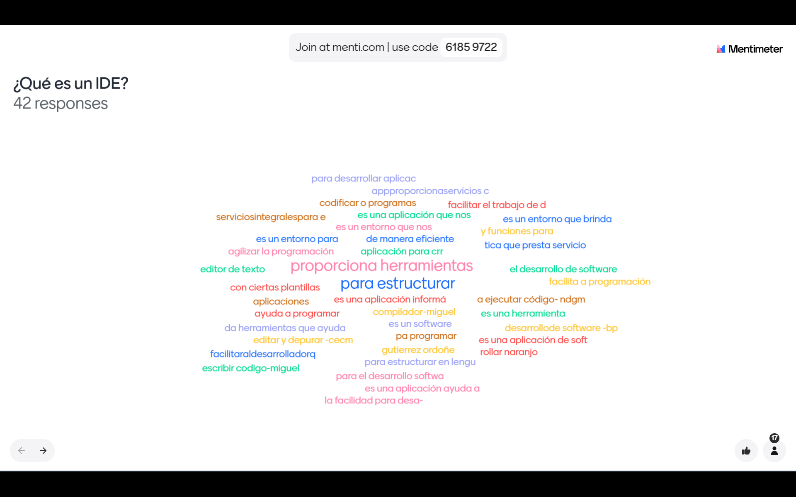

# IDE

# IDE: Permite compilar código

# Observación
- Versiones del jdk
- GPL => open - entreprise
- Tipo de empaquetamiento
- Empaquetamiento [.jar] [.war]
- Windows 11, 10, 8, Ubunto, Fedora, Mac OS

# Stack de herramientas

* Visual Studio Code / Android Studio / Intellij IDEA / eclipse IDE
* Postgresql  / mongoDB / mysql / h2 / sqlite
* figma / miro / draw.oi  / xd[adobe]
* git 
* yarn, npm[node], composer, PIP

## Stack extra
* Server VPS
* Docker
* Jenkins

# Instalar vue
npm install <paquete>: Instala un paquete.
npm i -g @vue/cli
npm install -g @vue/cli